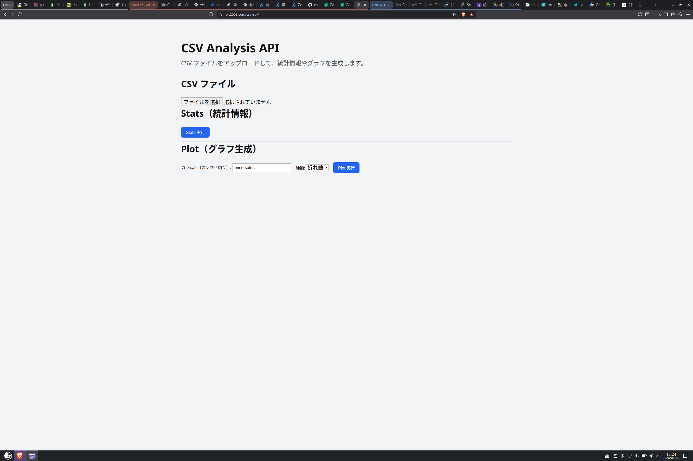
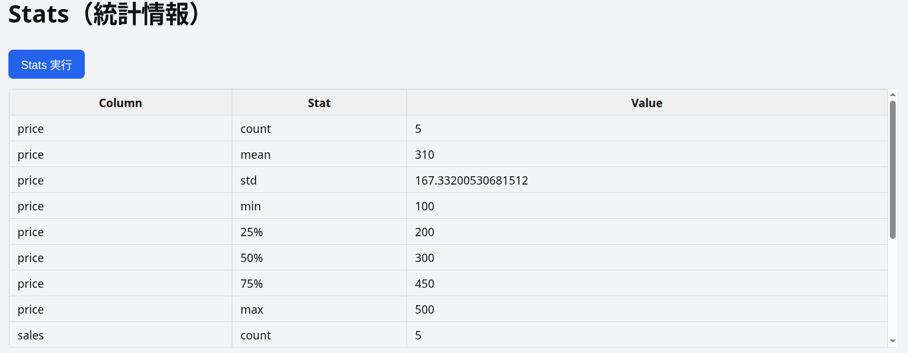
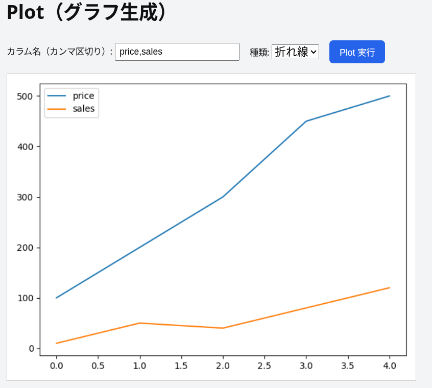

# CSV Analysis API & Portfolio Demo

FastAPI + Docker + nginx + HTTPS による  
CSV 分析・可視化 API の **実行可能ポートフォリオ**です。

---

## 🔗 Demo

- ポートフォリオトップ  
  https://www.oit2003.com/

- CSV API 実行画面  
  https://www.oit2003.com/csv-api/

---

## 📌 概要

CSV ファイルをアップロードすることで、以下を Web UI から直接実行できます。

- 統計情報の算出（count / mean / std / min / max）
- 折れ線グラフ（line）
- 棒グラフ（bar）
- 散布図（scatter）

バックエンド・フロントエンド・インフラを一貫して構築しています。

---

## 🖼 スクリーンショット

### ポートフォリオトップ


---

### CSV API 実行画面



---

### Stats 実行結果（統計テーブル）



---

### Plot 実行結果（グラフ表示）



---

## 🛠 技術スタック

| レイヤ | 技術 |
|------|------|
| Backend | FastAPI / Python |
| Data | pandas / matplotlib |
| Frontend | HTML / CSS / JavaScript |
| Container | Docker |
| Reverse Proxy | nginx |
| SSL | Let's Encrypt |
| OS | Raspberry Pi OS (ARM64) |

---

## 📂 構成

```text
csv-api/
├── main.py
├── Dockerfile
├── requirements.txt
├── README.md
└── screenshots/
    ├── portfolio_top.png
    ├── csv_api_ui.png
    ├── stats_result.png
    └── plot_result.png
```

```text
/var/www/html/
├── index.html
├── css/style.css
└── csv-api/index.html
```

---

## 🔌 提供 API

### Health Check

```
GET /health
```

Response:

```json
{ "status": "ok" }
```

---

### Stats（統計情報）

```
POST /status
```

Form Data:

- file: CSV ファイル

---

### Plot（グラフ生成）

```
POST /plot
```

Form Data:

- file: CSV ファイル
- column: カラム名（カンマ区切り）
- type: line / bar / scatter

Response:

- PNG 画像

---

## 🐳 Docker 実行

```bash
docker build -t csv-api .
docker run -d --restart unless-stopped -p 127.0.0.1:8000:8000 csv-api
```

---

## 🎯 目的

- FastAPI を用いた実践的 API 設計
- Docker + nginx + HTTPS による公開運用
- 採用担当者が **実際に触れるポートフォリオ**の提供

---

## 👤 Author

Yoshihiro Inamasu  
Python / FastAPI / Docker / Linux
